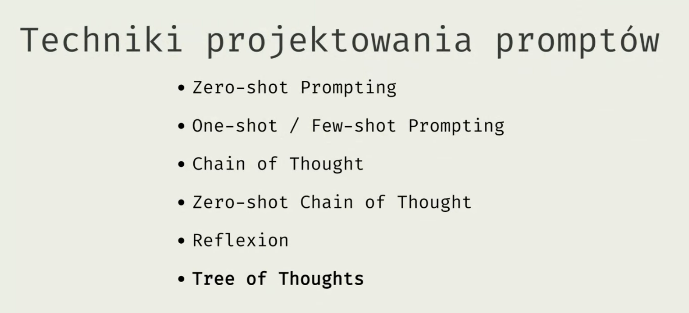

- Prompty AI
  collapsed:: true
	- Wdrożenie mikroserwisów na MiniPC
	  collapsed:: true
		- W pierwszym kroku chciałbym wdrożyć aplikację mikroserwisową na server. 
		  Server byłby niskonapieciowym miniPC w moim domu który byłby podłaczony 
		  do domowej sieci. 
		  W drugim kroku chciałbym się połączyć z wdrożoną aplikacją 
		  mikroserwisową z innego kumputera który byłby w tej samej sieci domowej.
		  Jak wykonać oba kroki?
- Jak skonfigurować lokalnie AI (OPEN-WEBUI + ollama3)
  collapsed:: true
	- docker run -d -p 1000:8080 --add-host=host.docker.internal:host-gateway -v open-webui:/app/backend/data --name open-webui --restart always ghcr.io/open-webui/open-webui:main
	- install wsl in your PowerShell:
	  wsl --install
	- start Ubuntu by typing in PS:
	  Ubuntu
	  ollama run llama3.1
	- To exit ollama type:
	  /bye
	- To exit Ubuntu type:
	  exit
- Techniki projektowania promptów
  collapsed:: true
	- 
- Spring AI
	- Ollama
	  id:: 66c492b4-3301-4664-9db8-527c4f8a70a7
		- https://howtodoinjava.com/spring-ai/spring-ai-ollama-example/
		- Jak uruchomić model LLM Ollama na Dockerze:
			- https://ollama.com/blog/ollama-is-now-available-as-an-official-docker-image
		- Dokumentacja Spring AI (Ollama):
			- https://docs.spring.io/spring-ai/reference/api/chat/ollama-chat.html#_multimodal
		- Ollama4j:
			- https://github.com/ollama4j/ollama4j?tab=readme-ov-file
		- Ollama chat + simple Rag:
		  collapsed:: true
			- {{video https://www.youtube.com/watch?v=xsjeIkTLf4s}}
			  https://github.com/ThomasJay/SpringBoot-AI-1.0-Ollama-LLama
	-