- Instalacja
  collapsed:: true
	- NVM (zbiór rożnych wersji node js)
	  https://github.com/coreybutler/nvm-windows
		- przydatne komendy (admin w PowerShellu):
			- **nvm + enter** -> wyświetla listę komend
			- **nvm current** -> pokazuje zainstalowaną wersję node.js
			- **nvm install 20** -> instaluje noda w wersji 20.15.1 LTS
			- **nvm use 20.15.1** -> ustawiamy wersję noda na 20.15.1
	- po zainstalowaniu node.js instalujemy **Angular CLI** komendą (admin w PowerShellu):
	  **npm i -g @angular/cli@18** i potem sprawdzamy komendą: **ng version**
	- komenda: **ng --help** -> wyświetla wszystkie komendy w angularze
	  oficjalna dokumentacja -> https://angular.dev/cli
- Tworzenie projektu wraz przydatnymi komendami
  collapsed:: true
	- **ng new nazwa-projektu --no-standalone** -> komenda do tworzenia projektu(od wersji 17)
	- zainstalowanie biblioteki bootstrap -> **npm install bootstrap@5.2.3**
	  :LOGBOOK:
	  CLOCK: [2024-07-18 Thu 09:55:23]--[2024-07-18 Thu 09:55:24] =>  00:00:01
	  :END:
	  Po zainstalowaniu trzeba w stylach dopisać scieżkę **"node_modules/bootstrap/dist/css/bootstrap.min.css"** w pliku **angular.json**
	  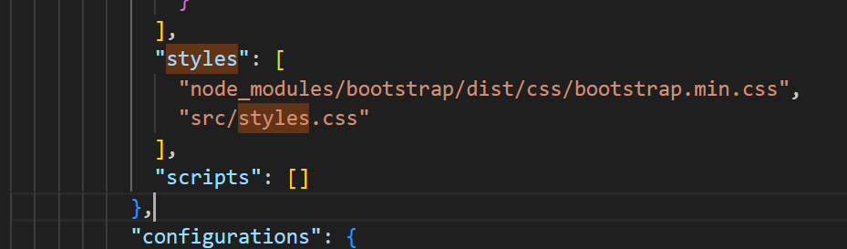{:height 137, :width 405}
	  Ścieżkę zainstalowanych styli **bootstrapa** (także innych bibliotek) zawsze dajemy nad ścieżką **"src/styles.css"**, w przeciwnym razie może na to nadpisywać style z głównego pliku **styles.css**
	  Po każdej modyfikacji pliku **angular.json** należy zrestartować aplikację
	- **ng g c nazwa** (ng generate component) -> generowanie komponentu
	- **ng g c footer --inline-template** -> generowanie komponentu bez pliku html, który dodajemy w komponencie (przydaje się przy małych komponentach jak stopki czy przyciski)
	- **ng g s nazwa** (ng generate service) -> generowanie serwisu
- Data Binding w Angular
  collapsed:: true
	- Data Binding to powiązanie stanu komponentu z widokiem HTML, rozróżniamy:
		- **One-way Data Binding** – z komponentu (pliku .ts) do szablonu (pliku HTML)
		  collapsed:: true
			- Interpolation (Interpolacja) za pomocą operatora {{}}
			  collapsed:: true
				- Służy do wyświetlania wartości (property) z klasy komponentu w widoku HTML.
				- Operator {{}}
				  Poniższy zapis wyświetli w komponecie napis „Witaj, Andrzej!
				  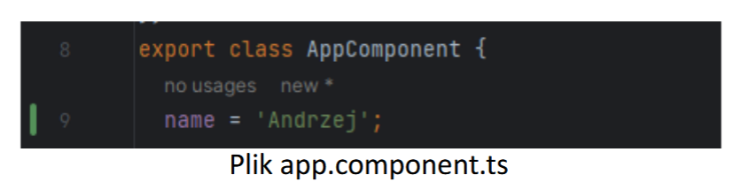{:height 108, :width 415}
				  {:height 176, :width 329}
			- Property Binding za pomocą operatora []
			  collapsed:: true
				- Służy do przypisania wartości z klasy komponentu do właściwości (property) elementów HTML w szablonie.
				- Operator []
				  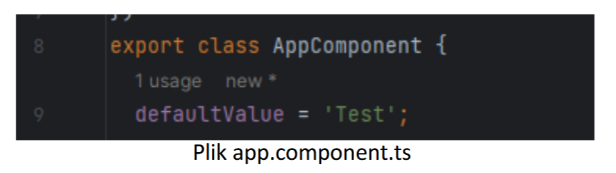{:height 125, :width 383}
				  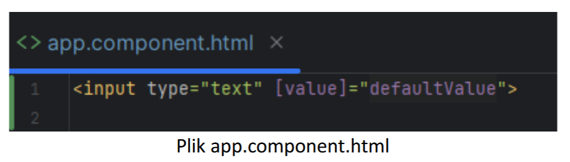{:height 123, :width 383}
		- **One-way Data Binding** – z szablonu (pliku HTML) do komponentu (pliku .ts).
		  collapsed:: true
			- Event Binding za pomocą operatora ()
				- Służy do reagowania na zdarzenia wywoływane przez użytkownika w aplikacji. W tym celu w komponencie należy zdefiniować metodę, która zostanie wywołana, gdy użytkownika wykona jakieś akcje w interfejsie.
				- Operator ()
				  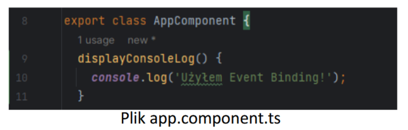{:height 151, :width 422}
				  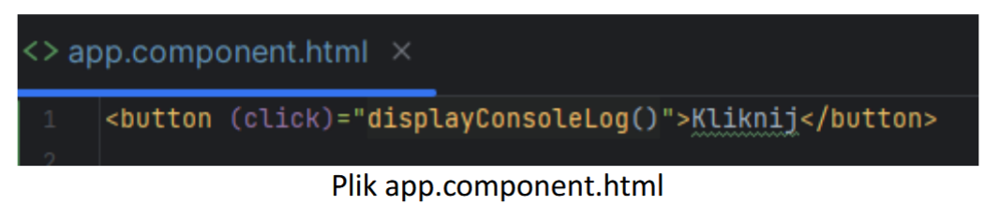{:height 101, :width 423}
		- **Two-way Data Binding** – zarówno z szablonu do pliku .ts, jak i z pliku .ts do szablonu. Połączenie Property Binding oraz Event Binding za pomocą dyrektywy [(ngModel)]
		  collapsed:: true
		  (konieczny import modułu FormsModule)
			- Służy do synchronizacji danych między koponentem, a szablonem (w obie strony). Zmiana danych w szablonie automatycznie zmieni wartość w klasie komponentu, a zmiana wartości w klasie komponentu automatycznie zostanie wyświetlona w szablonie.
			- Dyrektywa [(ngModel)]. Konieczny jest import modułu FormsModule w module, w którym znajduje się komponent.
			  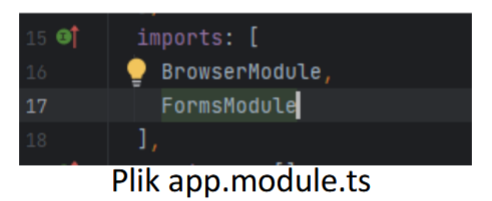{:height 145, :width 316}
			  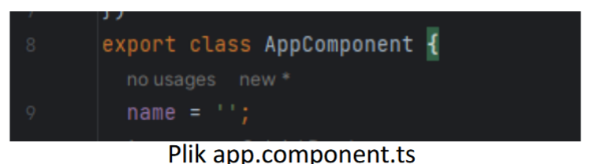{:height 133, :width 425}
			  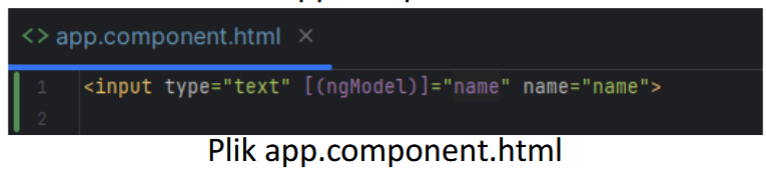{:height 94, :width 448}
- Dyrektywy w Angular
	- **Dyrektywy strukturalne** – dodawanie / usuwanie elementów z DOM
	  collapsed:: true
		- Dyrektywa * **ngFor** -> pozwala iterować po kolekcji danych np. po tablicy i wyświetlić odpowiednie dane. Poniżej przykład.
		  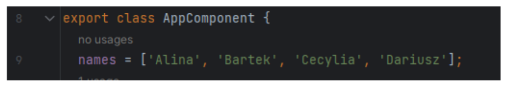{:height 80, :width 353}
		  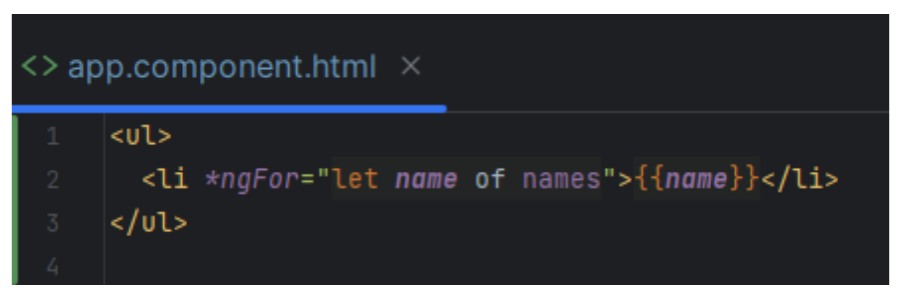{:height 133, :width 350}
		  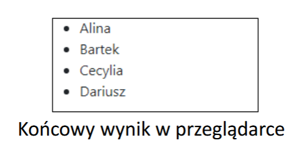{:height 138, :width 212}
		- Dyrektywa * **ngIf** -> pozwala na dynamiczne dodawanie lub usuwanie elementów z interfejsu użytkownika w zależności od wartości warunku. Elementy są usuwane z drzewa DOM i nie można ich podglądnąć w zakładce Elements w devtools.
		  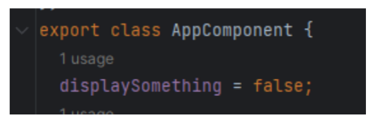{:height 89, :width 232}
		  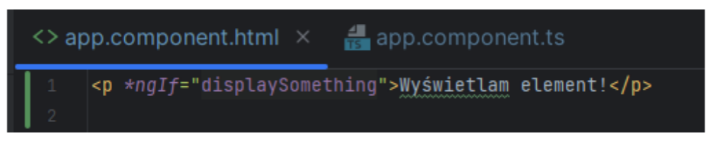{:height 95, :width 372}
		  Powyższy element **
** nie zostanie wyświetlony w przeglądarce, ponieważ właściwość **displaySomething** w app.component.ts ma wartość false
		- Dyrektywa * **ngSwitch** -> pozwala na dynamiczne przełączanie pomiędzy różnymi elementami interfejsu użytkownika w zależności od wartości wyrażenia.
		  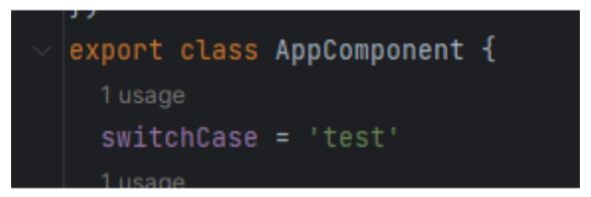{:height 108, :width 270}
		  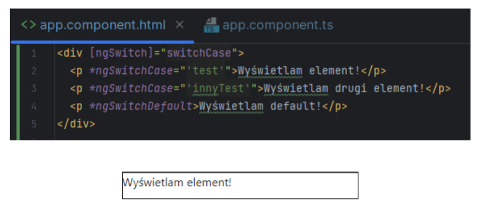{:height 178, :width 445}
		  W przeglądarce wyświetli się zawartość pierwszego **
**, ponieważ właściwość **switchCase** ma taką samą wartość, jak warunek przy * **ngSwitchCase**
	- **Dyrektywy atrybutowe** - zmiana wyglądu elementów DOM.
	  collapsed:: true
		- Dyrektywa * **ngStyle** -> pozwala na dynamiczne ustawianie stylów CSS na elemencie w oparciu o wartości właściwości w komponencie.
		  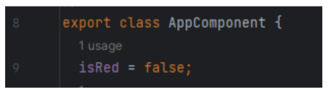{:height 94, :width 310}
		  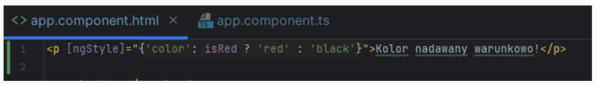{:height 97, :width 628}
		  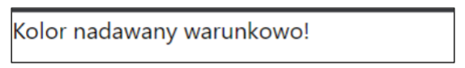{:height 54, :width 232}
		  W tym przypadku kolorem pozostanie czarny, ponieważ właściwość isRed jest ustawiona na wartość false
		- Dyrektywa * **ngClass** -> pozwala na dynamiczne dodawanie lub usuwanie klas CSS na elemencie w oparciu o wartości właściwości w komponentach.
		  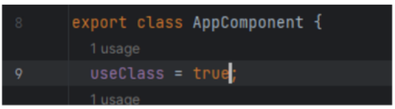{:height 96, :width 333}
		  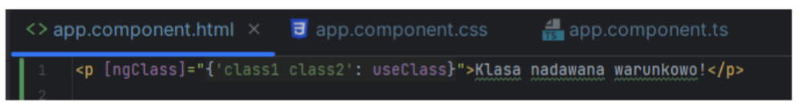{:height 84, :width 552}
		  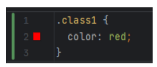{:height 88, :width 181}
		  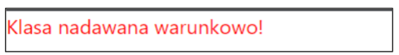{:height 48, :width 245}
		  Właścwiość **useClass** ma wartość true, więc element **
** otrzyma dwie klasy – **class1** oraz **class2**.
	- **Komponenty** - to także dyrektywa, ale posiada tzw. widok definiowany przez szablon HTML.
	- Test