- Instalacja
  collapsed:: true
	- NVM (zbiór rożnych wersji node js)
	  https://github.com/coreybutler/nvm-windows
		- przydatne komendy (admin w PowerShellu):
			- **nvm + enter** -> wyświetla listę komend
			- **nvm current** -> pokazuje zainstalowaną wersję node.js
			- **nvm install 20** -> instaluje noda w wersji 20.15.1 LTS
			- **nvm use 20.15.1** -> ustawiamy wersję noda na 20.15.1
	- po zainstalowaniu node.js instalujemy **Angular CLI** komendą (admin w PowerShellu):
	  **npm i -g @angular/cli@18** i potem sprawdzamy komendą: **ng version**
	- komenda: **ng --help** -> wyświetla wszystkie komendy w angularze
	  oficjalna dokumentacja -> https://angular.dev/cli
- Tworzenie projektu wraz przydatnymi komendami
  collapsed:: true
	- **ng new nazwa-projektu --no-standalone** -> komenda do tworzenia projektu(od wersji 17)
	- zainstalowanie biblioteki bootstrap -> **npm install bootstrap@5.2.3**
	  :LOGBOOK:
	  CLOCK: [2024-07-18 Thu 09:55:23]--[2024-07-18 Thu 09:55:24] =>  00:00:01
	  :END:
	  Po zainstalowaniu trzeba w stylach dopisać scieżkę **"node_modules/bootstrap/dist/css/bootstrap.min.css"** w pliku **angular.json**
	  {:height 137, :width 405}
	  Ścieżkę zainstalowanych styli **bootstrapa** (także innych bibliotek) zawsze dajemy nad ścieżką **"src/styles.css"**, w przeciwnym razie może na to nadpisywać style z głównego pliku **styles.css**
	  Po każdej modyfikacji pliku **angular.json** należy zrestartować aplikację
	- **ng g c nazwa** (ng generate component) -> generowanie komponentu
	- **ng g c footer --inline-template** -> generowanie komponentu bez pliku html, który dodajemy w komponencie (przydaje się przy małych komponentach jak stopki czy przyciski)
	- **ng g s nazwa** (ng generate service) -> generowanie serwisu
- Data Binding w Angular
  collapsed:: true
	- Data Binding to powiązanie stanu komponentu z widokiem HTML, rozróżniamy:
		- **One-way Data Binding** – z komponentu (pliku .ts) do szablonu (pliku HTML)
		  collapsed:: true
			- Interpolation (Interpolacja) za pomocą operatora {{}}
			  collapsed:: true
				- Służy do wyświetlania wartości (property) z klasy komponentu w widoku HTML.
				- Operator {{}}
				  Poniższy zapis wyświetli w komponecie napis „Witaj, Andrzej!
				  {:height 108, :width 415}
				  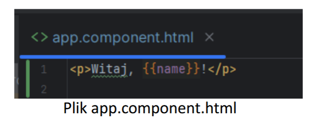{:height 176, :width 329}
			- Property Binding za pomocą operatora []
			  collapsed:: true
				- Służy do przypisania wartości z klasy komponentu do właściwości (property) elementów HTML w szablonie.
				- Operator []
				  {:height 125, :width 383}
				  {:height 123, :width 383}
		- **One-way Data Binding** – z szablonu (pliku HTML) do komponentu (pliku .ts).
		  collapsed:: true
			- Event Binding za pomocą operatora ()
				- Służy do reagowania na zdarzenia wywoływane przez użytkownika w aplikacji. W tym celu w komponencie należy zdefiniować metodę, która zostanie wywołana, gdy użytkownika wykona jakieś akcje w interfejsie.
				- Operator ()
				  {:height 151, :width 422}
				  {:height 101, :width 423}
		- **Two-way Data Binding** – zarówno z szablonu do pliku .ts, jak i z pliku .ts do szablonu. Połączenie Property Binding oraz Event Binding za pomocą dyrektywy [(ngModel)]
		  collapsed:: true
		  (konieczny import modułu FormsModule)
			- Służy do synchronizacji danych między koponentem, a szablonem (w obie strony). Zmiana danych w szablonie automatycznie zmieni wartość w klasie komponentu, a zmiana wartości w klasie komponentu automatycznie zostanie wyświetlona w szablonie.
			- Dyrektywa [(ngModel)]. Konieczny jest import modułu FormsModule w module, w którym znajduje się komponent.
			  {:height 145, :width 316}
			  {:height 133, :width 425}
			  {:height 94, :width 448}
- Dyrektywy w Angular
  collapsed:: true
	- **Dyrektywy strukturalne** – dodawanie / usuwanie elementów z DOM
	  collapsed:: true
		- Dyrektywa * **ngFor** -> pozwala iterować po kolekcji danych np. po tablicy i wyświetlić odpowiednie dane. Poniżej przykład.
		  {:height 80, :width 353}
		  {:height 133, :width 350}
		  {:height 138, :width 212}
		- Dyrektywa * **ngIf** -> pozwala na dynamiczne dodawanie lub usuwanie elementów z interfejsu użytkownika w zależności od wartości warunku. Elementy są usuwane z drzewa DOM i nie można ich podglądnąć w zakładce Elements w devtools.
		  {:height 89, :width 232}
		  {:height 95, :width 372}
		  Powyższy element **
** nie zostanie wyświetlony w przeglądarce, ponieważ właściwość **displaySomething** w app.component.ts ma wartość false
		- Dyrektywa * **ngSwitch** -> pozwala na dynamiczne przełączanie pomiędzy różnymi elementami interfejsu użytkownika w zależności od wartości wyrażenia.
		  {:height 108, :width 270}
		  {:height 178, :width 445}
		  W przeglądarce wyświetli się zawartość pierwszego **
**, ponieważ właściwość **switchCase** ma taką samą wartość, jak warunek przy * **ngSwitchCase**
	- **Dyrektywy atrybutowe** - zmiana wyglądu elementów DOM.
		- Dyrektywa * **ngStyle** -> pozwala na dynamiczne ustawianie stylów CSS na elemencie w oparciu o wartości właściwości w komponencie.
		  {:height 94, :width 310}
		  {:height 97, :width 628}
		  {:height 54, :width 232}
		  W tym przypadku kolorem pozostanie czarny, ponieważ właściwość isRed jest ustawiona na wartość false
		- Dyrektywa * **ngClass** -> pozwala na dynamiczne dodawanie lub usuwanie klas CSS na elemencie w oparciu o wartości właściwości w komponentach.
		  {:height 96, :width 333}
		  {:height 84, :width 552}
		  {:height 88, :width 181}
		  {:height 48, :width 245}
		  Właścwiość **useClass** ma wartość true, więc element **
** otrzyma dwie klasy – **class1** oraz **class2**.
	- **Komponenty** - to także dyrektywa, ale posiada tzw. widok definiowany przez szablon HTML.
	- **ng-container** - to specjalny element, który służy jako logiczny kontener do  grupowania elementów DOM bez dodawania dodatkowego węzła do drzewa DOM. Oto najważniejsze cechy i zastosowania ng-container:
	  collapsed:: true
		- Jest to element logiczny, który nie renderuje się w finalnym drzewie DOM - zamiast tego jest renderowany jako komentarz HTML.
		- Służy głównie do grupowania elementów bez konieczności dodawania dodatkowego elementu HTML (jak np. div).
		- Jest szczególnie przydatny przy używaniu dyrektyw strukturalnych, takich jak *ngIf, *ngFor czy *ngSwitch.
		- Pozwala na stosowanie wielu dyrektyw strukturalnych na jednym fragmencie kodu bez konieczności dodawania dodatkowych elementów.
		- Pomaga uniknąć problemów z stylami CSS, które mogłyby wystąpić przy dodawaniu dodatkowych elementów div lub span.
		- Jest często używany do warunkowego renderowania grup elementów.
		- Może być używany do poprawy czytelności kodu poprzez logiczne grupowanie elementów.
		- W przeciwieństwie do ng-template, ng-container nie wymaga użycia dyrektywy strukturalnej do renderowania zawartości.
		  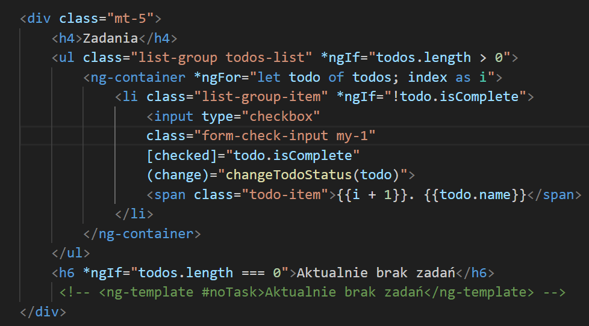{:height 305, :width 523}
- Sposoby komunikacji między komponentami
  collapsed:: true
	- Dekorator **@Input()**
	  collapsed:: true
		- Za pomocą tego dekoratora komponent rodzic (parent) może przekazywać dane do komponentu dziecka(child). 
		  Dekorator przyjmuje opcjonalną nazwę do użycia np. @Input('nazwa-wlasciwosci'). Konieczny jest import **Input** z **@angular/core** jak na załączonym poniżej obrazku.
		  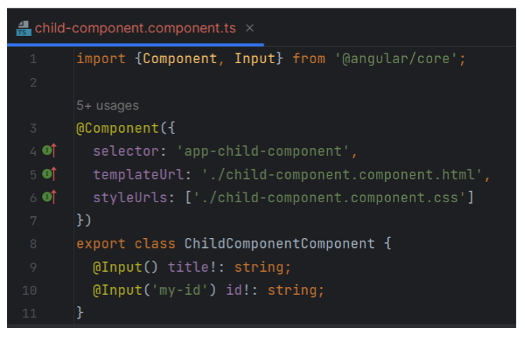{:height 274, :width 416}
		  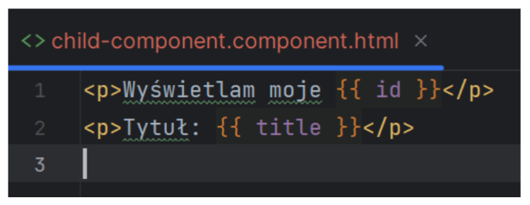{:height 125, :width 295}
		  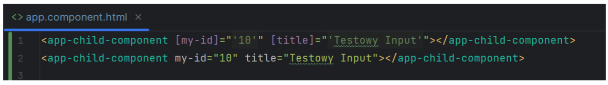
		  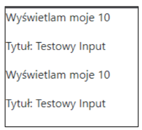{:height 133, :width 140}
	- Dekorator **@Output()**
	  collapsed:: true
		- Za pomocą tego dekoratora komponent dziecko (child) może komunikować się z komponentem rodzicem (parent). Dekorator przyjmuje opcjonalną nazwę do użycia np. @Output('my-event'). Konieczny jest import **Output** oraz **EventEmitter** z **@angular/core**.
		  id:: 669e1e29-b849-4f9c-b57f-65f36f96bb26
		  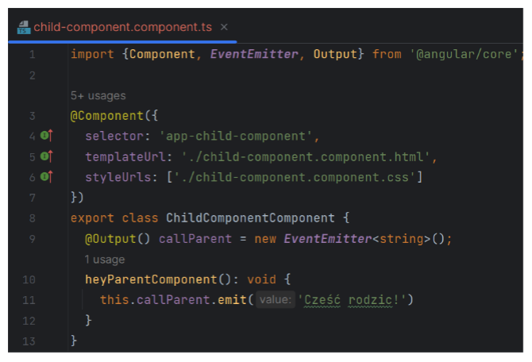{:height 340, :width 492}
		  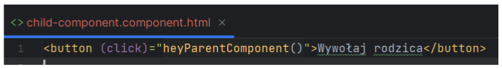{:height 70, :width 499}
		  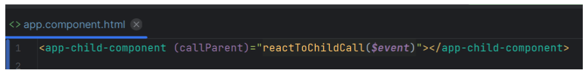{:height 92, :width 653}
		  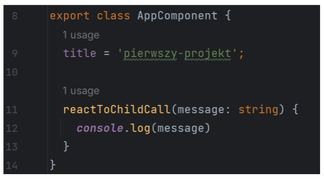{:height 215, :width 356}
- Lifecycle hooks w Angular
  collapsed:: true
	- to specjalne metody, które pozwalają na wykonanie kodu w kluczowych momentach cyklu życia komponentu lub dyrektywy.
		- Główne lifecycle hooks:
			- 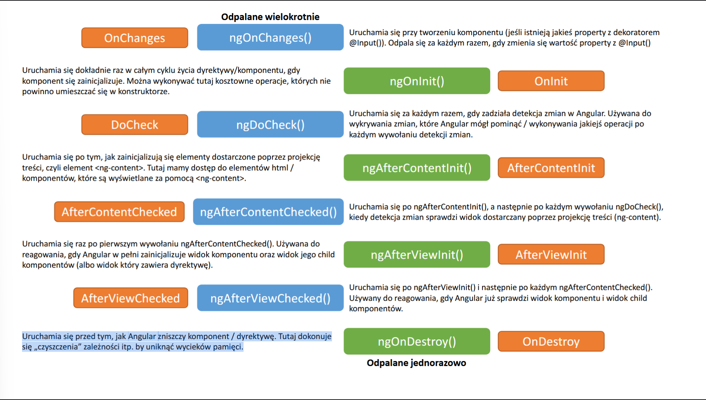
			- Odpalane jednorazowo:
				- **ngOnInit() - OnInit**
				  Uruchamia się dokładnie raz w całym cyklu życia dyrektywy/komponentu, gdy komponent się zainicjalizuje. Można wykonywać tutaj kosztowne operacje, których nie powinno umieszczać się w konstruktorze.
				- **ngAfterContentInit() - AfterContentInit**
				  Uruchamia się po tym, jak zainicjalizują się elementy dostarczone poprzez projekcję treści, czyli element <ng-content>. Tutaj mamy dostęp do elementów html / komponentów, które są wyświetlane za pomocą <ng-content>.
				- **ngAfterViewInit() - AfterViewInit**
				  Uruchamia się raz po pierwszym wywołaniu ngAfterContentChecked(). Używana do
				  reagowania, gdy Angular w pełni zainicjalizuje widok komponentu oraz widok jego child
				  komponentów (albo widok który zawiera dyrektywę).
				- **ngOnDestroy() - OnDestroy**
				  Uruchamia się przed tym, jak Angular zniszczy komponent / dyrektywę. Tutaj dokonuje
				  się „czyszczenia” zależności itp. by uniknąć wycieków pamięci.
			- Odpalane wielokrotnie:
				- **OnChanges - ngOnChanges()** - Uruchamia się przy tworzeniu komponentu (jeśli istnieją jakieś property z dekoratorem @Input()). Odpala się za każdym razem, gdy zmienia się wartość property z @Input().
				- **DoCheck - ngDoCheck()** - Uruchamia się za każdym razem, gdy zadziała detekcja zmian w Angular. Używana do wykrywania zmian, które Angular mógł pominąć / wykonywania jakiejś operacji po każdym wywołaniu detekcji zmian.
				- **AfterContentChecked - ngAfterContentChecked()** - Uruchamia się po ngAfterContentInit(), a następnie po każdym wywołaniu ngDoCheck(), kiedy detekcja zmian sprawdzi widok dostarczany poprzez projekcję treści (ng-content).
				- **AfterViewChecked - ngAfterViewChecked()** - Uruchamia się po ngAfterViewInit() i następnie po każdym ngAfterContentChecked(). Używany do reagowania, gdy Angular już sprawdzi widok komponentu i widok child komponentów.
- Pipe
  collapsed:: true
	- To proste funkcje, używane w szablonie HTML, które przyjmują jakąś wartość na
	  wejściu i zwracają ją w zmienionej postaci
	- Używane do formatowania string’ów, walut, liczb, dat itp. 
	  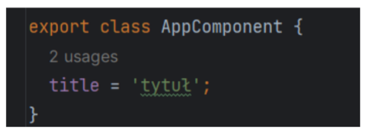{:height 113, :width 296}
	  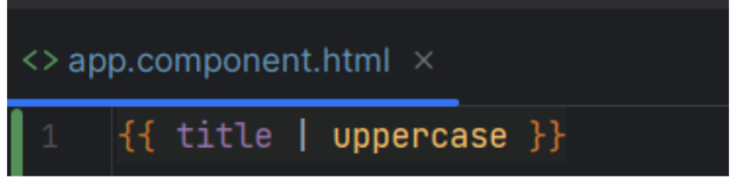{:height 111, :width 350}
	- Wbudowane Pipe
	  collapsed:: true
		- AyncPipe (async) – obsługa asynchronicznych działań (Promise/Observable)
		- CurrencyPipe (currency) – wyświetlanie liczb w formie walut
		- DatePipe (date) – formatowanie dat (można dopasować do dat lokalnych)
		- DecimalPipe (number) – formatowanie liczb zależnie od ustawień lokalnych i separatora
		- JsonPipe (json) – zamienia obiekt w jego reprezentacje w postaci JSON (którą można wyświetlić za pomocą interpolacji)
		- KeyValuePipe (keyvalue) – zamienia obiekt w tablicę z parami klucz-wartość
		- LowerCasePipe (lowercase) – zmienia cały tekst na pisany małymi literami
		- PercentPipe (percent) – zamienia liczbę na jej reprezentację w procentach
		- SlicePipe (slice) – tworzy nową tablicę lub string zawierający wycięty kawałek początkowej
		  wartości
		- UpperCasePipe (uppercase) – zmienia cały tekst na pisany dużymi literami
		- TitleCasePipe (titlecase) – formatuje zdanie, żeby każde słowo zaczynało się z dużej litery
	- Tworzenie własnych Pipe -> **ng g p shared/pipes/first-letter-uppercase**
	  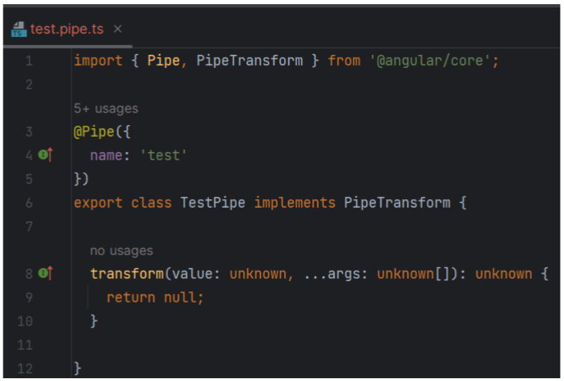{:height 304, :width 431}
	  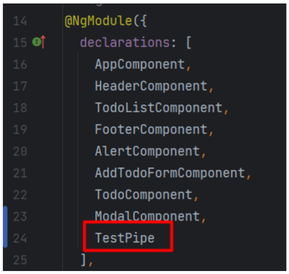{:height 262, :width 251}
- Biblioteka RxJS
	-