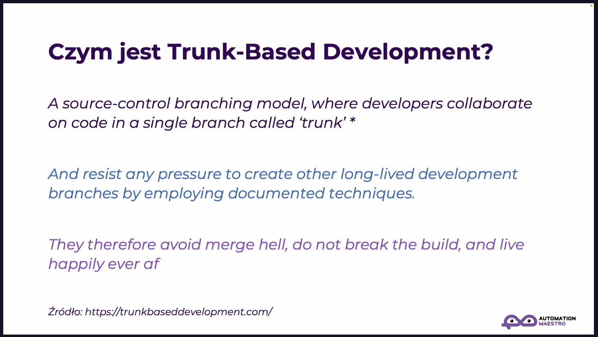

- Automation Big Picture
	- Wprowadzenie do Trunk Based Development
	  collapsed:: true
		- {:height 316, :width 554}
			- **Tłumaczenie powyższego screena:**
			  Model kontroli źródła oparty na gałęziach, w którym programiści współpracują nad kodem w pojedynczej gałęzi zwanej 'trunk'*
			  I opierają się wszelkim naciskom na tworzenie innych długotrwałych gałęzi rozwojowych, stosując udokumentowane techniki.
			  Dzięki temu unikają piekła scalania, nie psują kompilacji i żyją długo i szczęśliwie
			  Źródło: [https://trunkbaseddevelopment.com/](https://trunkbaseddevelopment.com/)
		- {:height 346, :width 561}
		- {:height 359, :width 560}
		- {:height 333, :width 557}
		- {:height 372, :width 561}
		- {:height 336, :width 558}
		  Kroki 3 i 5 są uruchamiane przez Continous Integration
		- {:height 334, :width 559}
		- 
	- Typy podejść do wydawania nowych wersji kodu oraz podejście do naprawiania błędów na produkcji
	  collapsed:: true
		- {:height 300, :width 520}
		- {:height 318, :width 524}
		- {:height 309, :width 527}
		- {:height 421, :width 526}
		- {:height 344, :width 526}
		- {:height 315, :width 527}
		- {:height 359, :width 527}
-