collapsed:: true
1. K8s - teoria architektury

	- Jak działa Kubernetes?
		- 
		   
		  
	- Control plane (master nody) - szczegóły...
		- składa się z komponentów:
		  {:height 282, :width 307}
			- apiServer
				- {:height 143, :width 255}
			- scheduler
				- {:height 168, :width 227}
			- controller-manager
				- {:height 186, :width 248}
			- cloud-controller-manager
				- {:height 121, :width 246}
			- etcd - baza danych która przechowuje stan całego klastra
				- {:height 151, :width 245}
		- liczba master nodów powinna byc nieparzysta (najlepiej min. 3)
		  
			- Gdy cos pójdzie nie tak...
			  {:height 167, :width 356}
			- Jak ma się do tego wspomniane *quorum*?
			  
			  wzór na *quorum* określa nam jak powinna byc minimalna ilość master nodów, aby zachować quorum dla bazy etcd
			- 
			- 
		- {:height 143, :width 483}
		- {:height 228, :width 478}
		-
	- Data plane (worker nody)
		- {:height 264, :width 472}
			- kubelet
			  {:height 167, :width 287}
			- kube-proxy
			  {:height 193, :width 293}
			- container-runtime
			  {:height 269, :width 291}
			  <<<<<<< HEAD
- collapsed:: true
  2. K8s - Big Picture
	- Pod - najmniejsza jednostka w K8s
	  collapsed:: true
		- 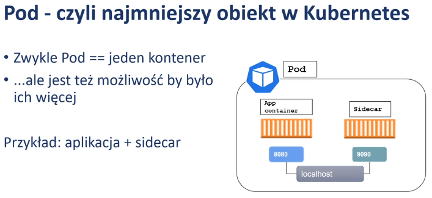{:height 196, :width 416}
		  Sidecar - kontener z fragmentem kodu która agreguje logi z kontenera głównej aplikacji i np.przesyła je do zewn. systemu. Jest to mozliwe, że kontenery współdziela ten sam interfejs sieciowy.
		  {:height 223, :width 669}
	- Kontener vs Pod
	  collapsed:: true
		- 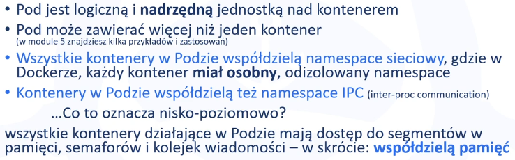
		  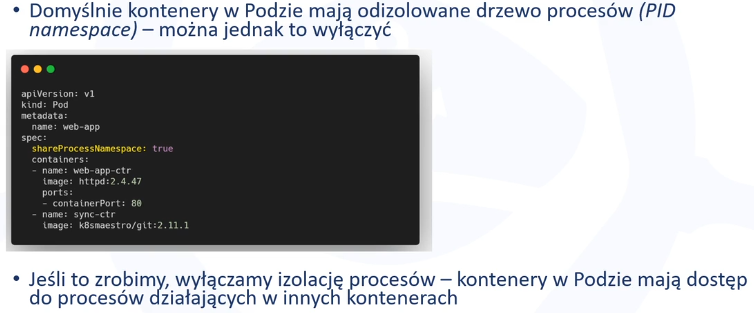
		- Pod w Dockerze
		  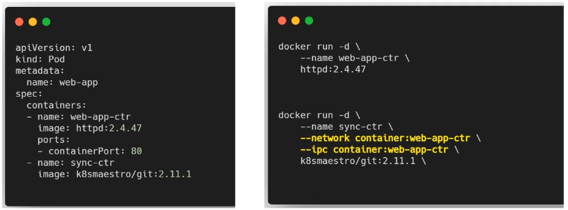
		- *kubectl* w porównaniu do *Docker CLI*
		  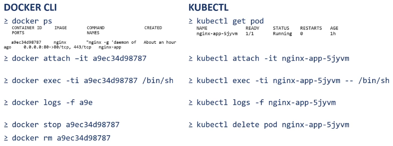
	- Format YAML
	  collapsed:: true
		- ```
		  --- # seperator jeśli definiujemy więcej niż jedą strukturę
		  
		  # struktura typu nazwa-wartość
		  apiVersion: v1 # wersja api
		  
		  # nazwa-wartość
		  kind: Pod # rodzaj obiektu
		  
		  # bardziej rozbudowana struktura typu nazwa-wartość
		  metadata:
		    name: hello-pod # spacje, zamiast tabów - zwykle dwie spacje
		    labels:
		      app: web
		      zone: prod
		      version: v1
		  
		  spec:
		    containers:
		      # lista, czyli inaczej sekwencja obiektów
		      # Przykład: 
		  
		      # args:
		      # - sleep
		      # - "1000"
		      # - message
		      # - "Friday, please!"
		  
		      # obiekt również może być strukturą typu nazwa-wartość
		      - name: front-end
		        image: dnaprawa/hello-kubernetes:1.0
		        ports:
		          # możemy robić zagnieżdżone listy
		          - containerPort: 80
		          # tutaj_mógłby_być_element_listy:
		          #   - a_tutaj_kolejne_zagnieżdzenie
		          #     kolejny_element:
		          #     kolejny_element:
		          #       - lista
		  
		      - name: backend # nazwa kontenera
		        image: image.registry.com/backend # obraz
		        ports: 
		          - containerPort: 8080 # na jakim porcie usługa działa w kontenerze
		  ---
		  apiVersion: v1
		  kind: Pod
		  metadata:
		    name: hello-pod-2 # spacje, zamiast tabów - zwykle dwie spacje
		    labels:
		      app: web-1
		      zone: prod-1
		      version: v1-1
		  ```
	- Podejście imperatywne vs deklaratywne
	  collapsed:: true
		- podejście imperatywne
		  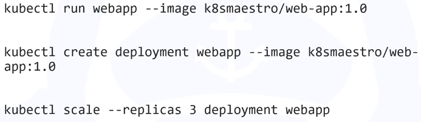{:height 144, :width 464}
		- podejście deklaratywne
		  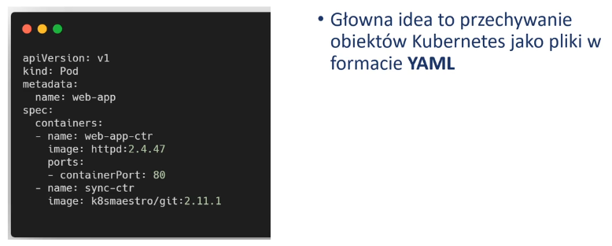
	- ReplicatSet
		- Zadaniem K8s nie jest dbanie, by ten sam kontener działał ciągle i nieprzerwanie, lecz by ilość i stan kontenerów się zgadzała.
		  id:: 68665d7f-6074-4a91-a1e2-3f6847b6ca34
		  Zadanie to wykonuje jeden z podstawowych mechanizmów w Kubernetes - ReplicaSet.
		  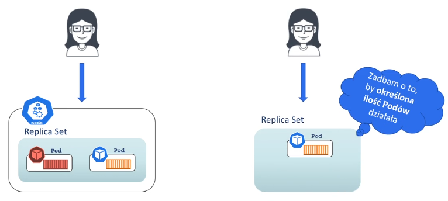
		- 
		  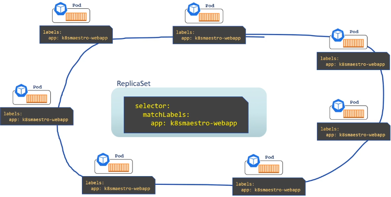
	-
- collapsed:: true
  3. Konfiguracja i wzorce
	- 3.1 Przekazywanie argumentów
	  collapsed:: true
		- 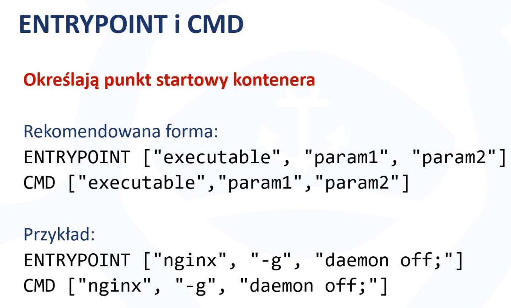
		- 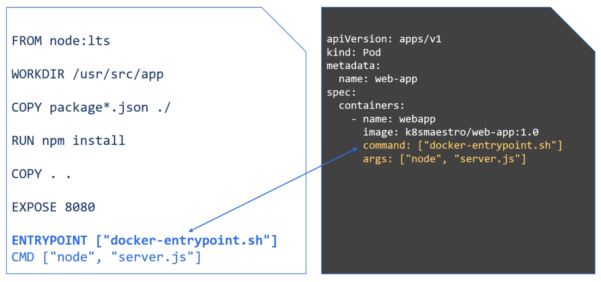
		  ENTRYPOINT oraz CMD z dockerfile to odpowiednik "command" i "args" w pliku yaml w K8s
		- 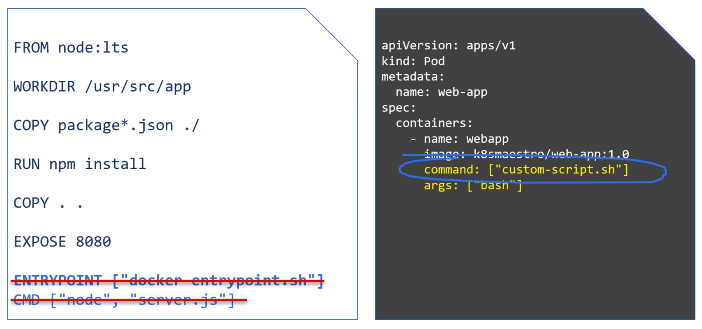
		-
	- 3.2 Zmienne środowiskowe
	  collapsed:: true
		- 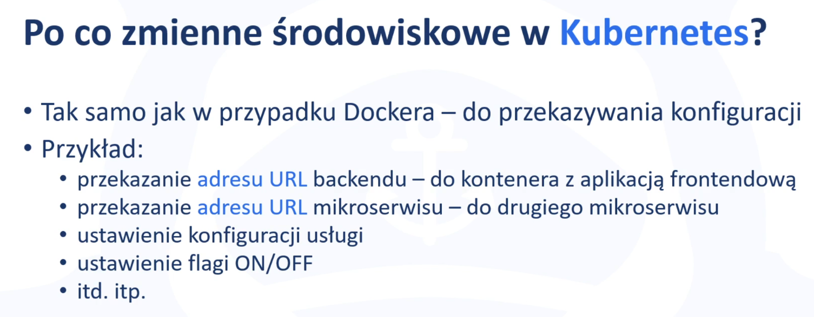
		- 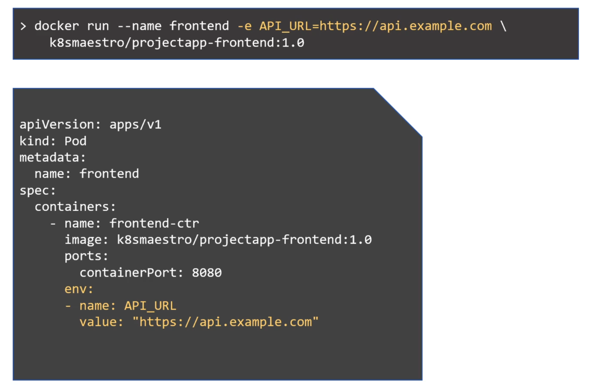
		- 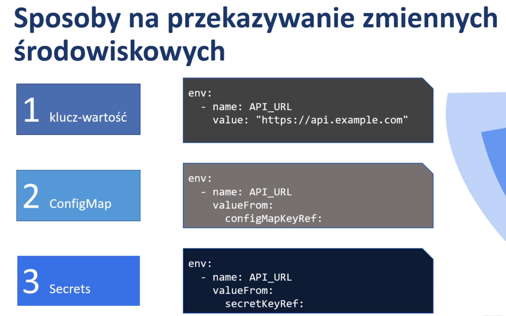
	- 3.3 Sposoby na przekazywanie konfiguracji do kontenerów
	  collapsed:: true
		- 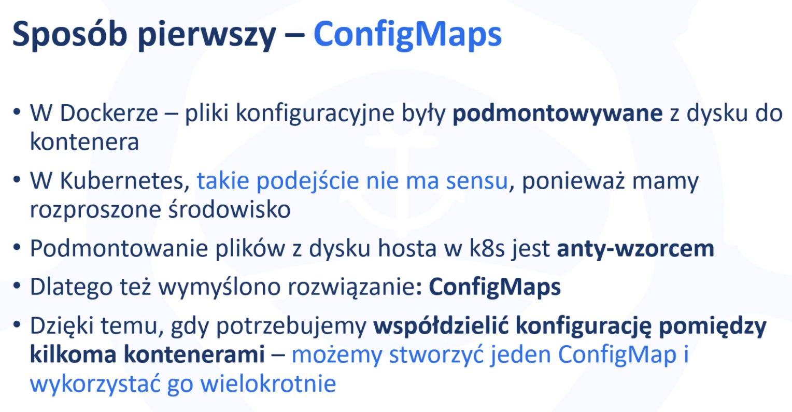
		- 
		- 
		- 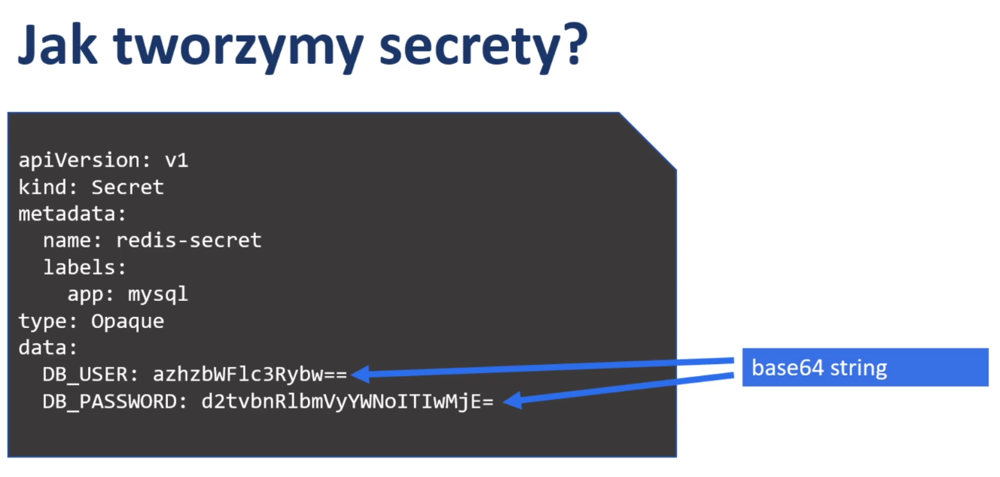
	- 3.4 Przekazywanie konfiguracji - Sposób 1 - ConfigMaps
		- 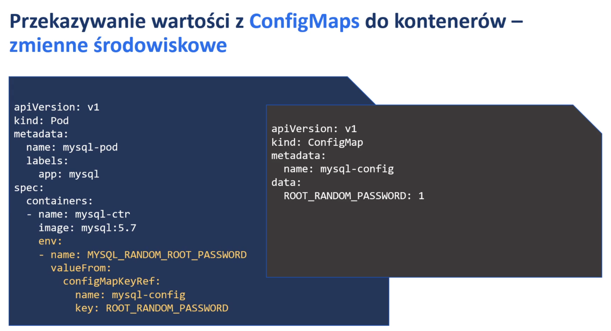
		- 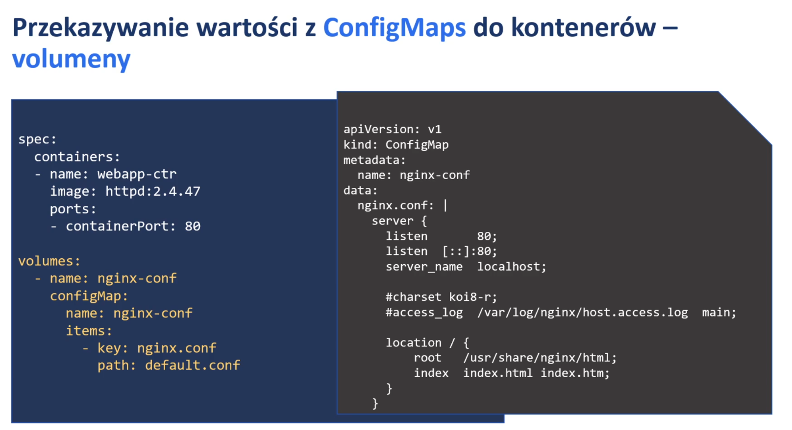
		- 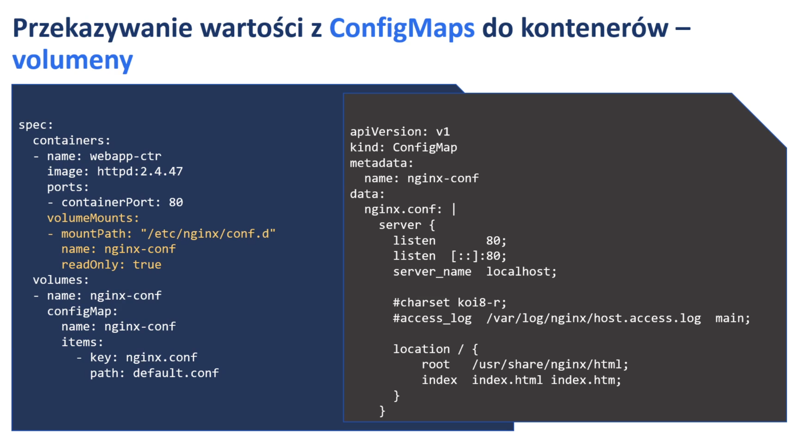
		-
-
-