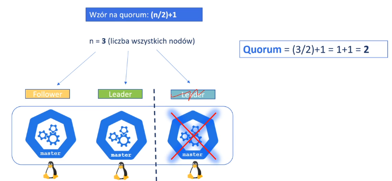
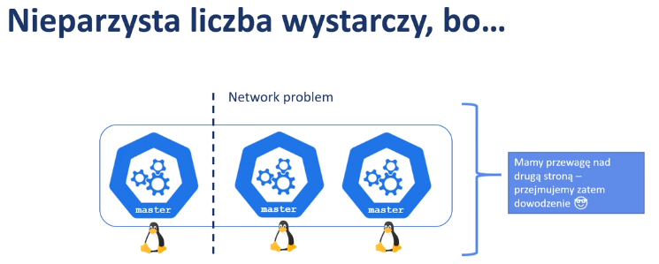

- 1. K8s - teoria architektury
	- Jak działa Kubernetes?
	  collapsed:: true
		- 
		   
		  
	- Control plane (master nody) - szczegóły...
	  collapsed:: true
		- składa się z komponentów:
		  {:height 282, :width 307}
			- apiServer
				- {:height 143, :width 255}
			- scheduler
				- {:height 168, :width 227}
			- controller-manager
				- {:height 186, :width 248}
			- cloud-controller-manager
				- {:height 121, :width 246}
			- etcd - baza danych która przechowuje stan całego klastra
				- {:height 151, :width 245}
		- liczba master nodów powinna byc nieparzysta (najlepiej min. 3)
		  
			- Gdy cos pójdzie nie tak...
			  {:height 167, :width 356}
			- Jak ma się do tego wspomniane *quorum*?
			  
			  wzór na *quorum* określa nam jak powinna byc minimalna ilość master nodów, aby zachować quorum dla bazy etcd
			- 
			- 
		- {:height 143, :width 483}
		- {:height 228, :width 478}
		-
	- Data plane (worker nody)
	  collapsed:: true
		- {:height 264, :width 472}
			- kubelet
			  {:height 167, :width 287}
			- kube-proxy
			  {:height 193, :width 293}
			- container-runtime
			  {:height 269, :width 291}
-