- KURS LINUX
	- KOMENDY
		- Basic Commands
		  collapsed:: true
			- 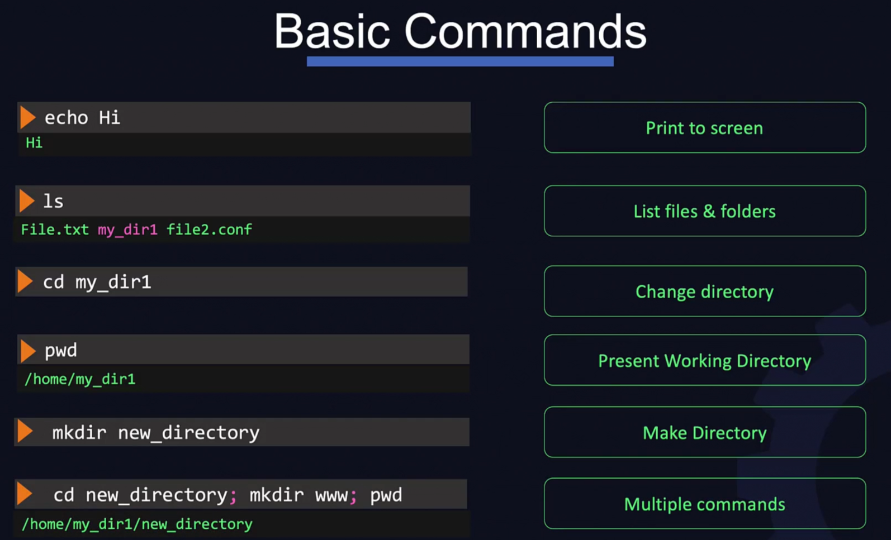{:height 423, :width 676}
		- Commands - Directories
		  collapsed:: true
			- 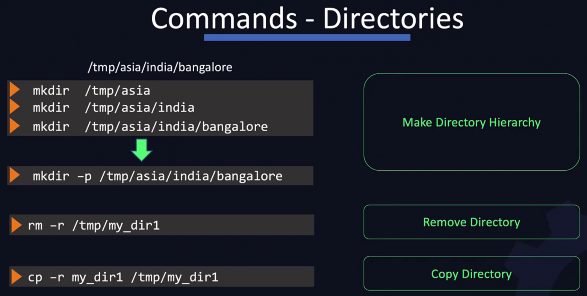{:height 343, :width 673}
		- Commands - Files
		  collapsed:: true
			- 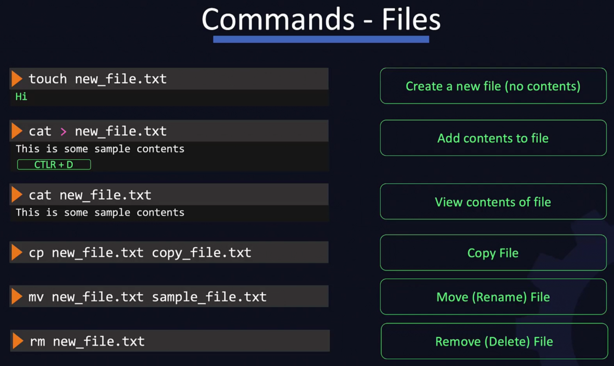{:height 407, :width 675}
		- User Accounts
		  collapsed:: true
			- {:height 387, :width 678}
			- 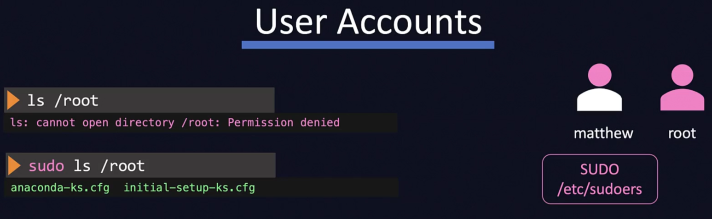{:height 217, :width 683}
		- Download Files
		  collapsed:: true
			- 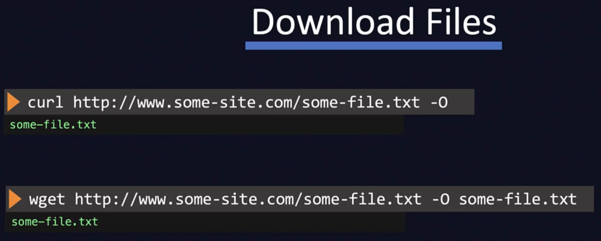{:height 281, :width 680}
		- Check OS Version
		  collapsed:: true
			- 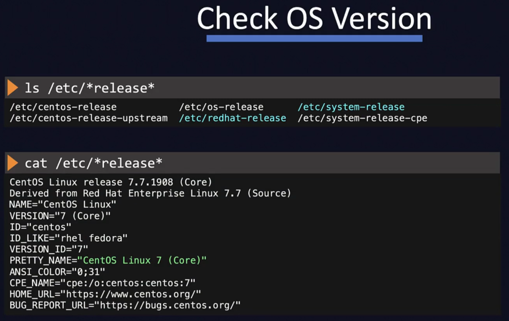{:height 437, :width 680}
		- Package Management
		  collapsed:: true
			- 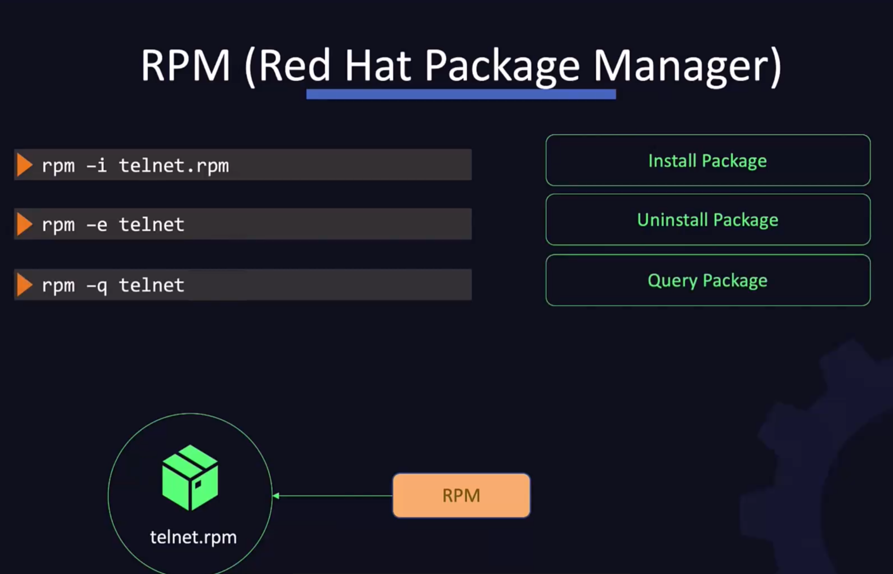{:height 446, :width 678}
			- 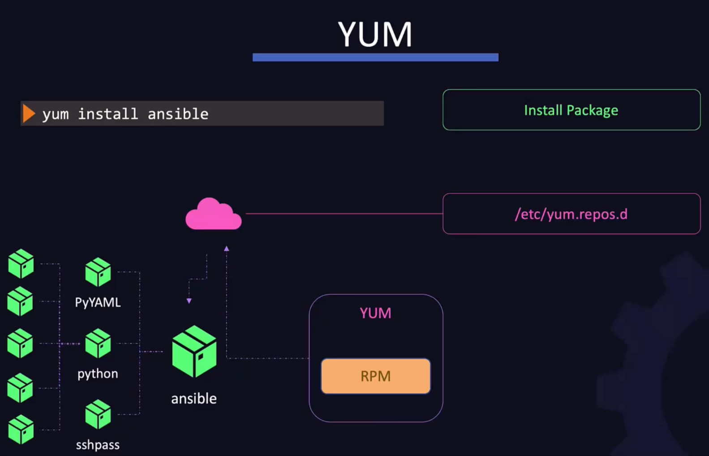{:height 456, :width 680}
			- 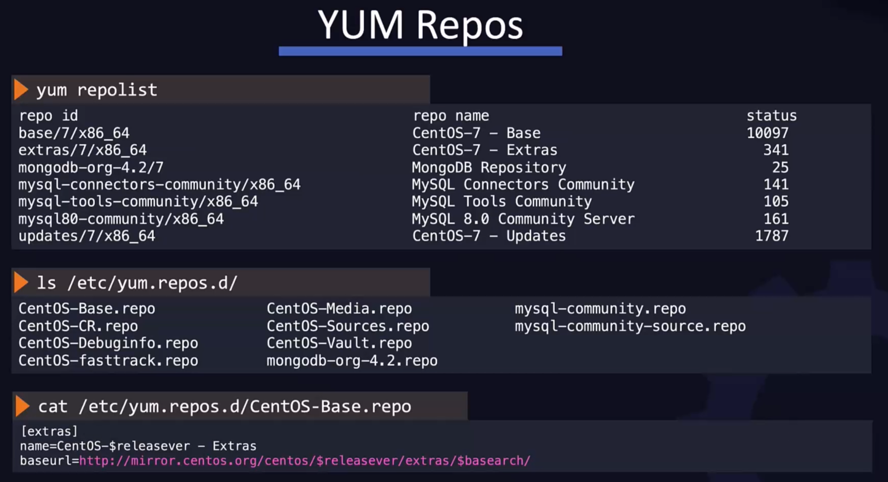{:height 391, :width 680}
			- 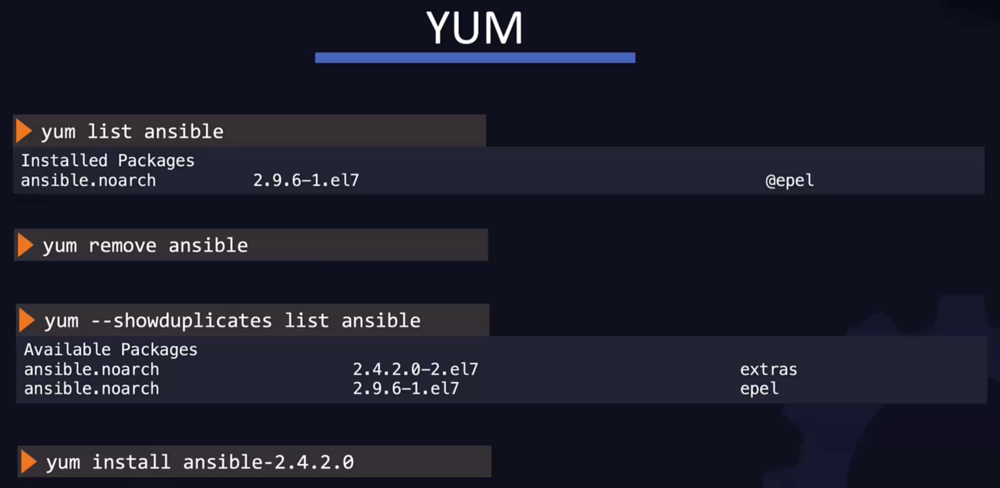{:height 342, :width 683}
		- Services
		  collapsed:: true
			- 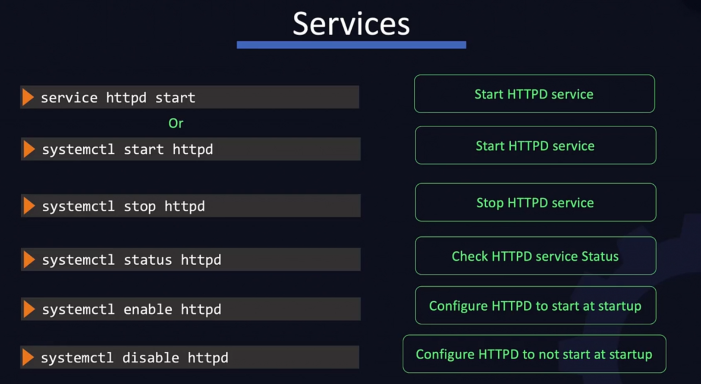
			- 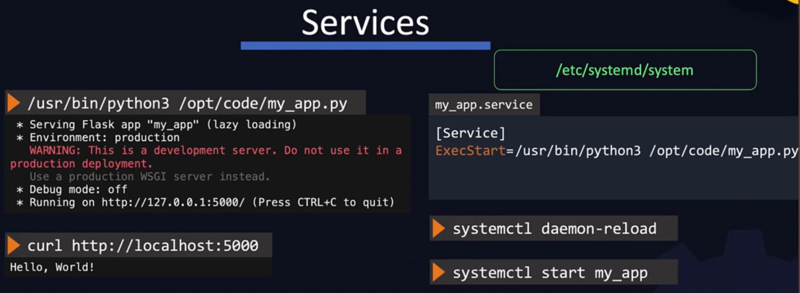
			- 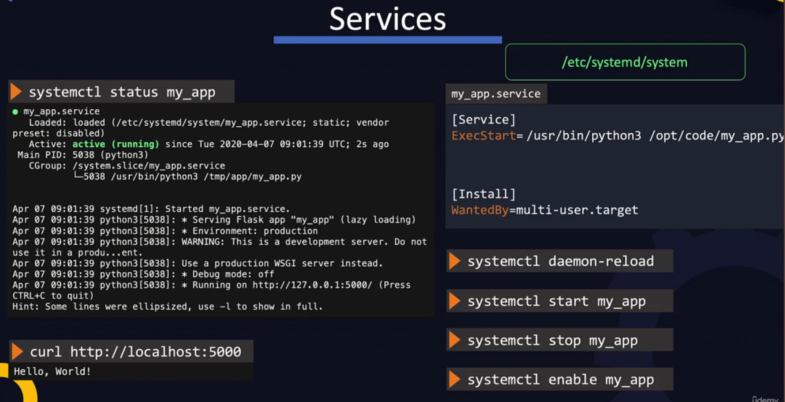
			- 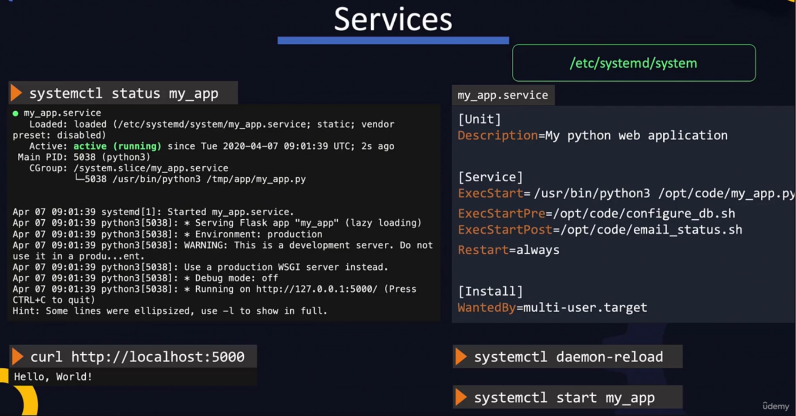
- Narzędzia:
  collapsed:: true
	- Sprawdzanie dysku SSD (temp i inne)
		- https://www.maketecheasier.com/check-the-health-of-ssd-in-ubuntu/
		- ```
		  sudo apt install nvme-cli
		  sudo watch -n 1 nvme smart-log /dev/nvme0n1
		  ```
		- For this command, `watch -n 1` tells the tool to check the SMART log each second. The `nvme` portion refers to the type of drive, while the `smart-log` portion tells the tool to check the SMART log.
		  
		  After running the tool, check the following results to get a better idea of your SSD’s health in Linux:
		- **Temperature** – A safe range is 30°C to 65°C (86°F and 149°F). Usually, it’ll stay within the 30°C to 40°C range unless you’re a power user.
		- **Percentage_Used** – You want this number to be as low as possible. As it creeps over halfway, your SSD could be in trouble.
		- **Media_Errors** – A few errors aren’t much to worry 
		  about. But, if you start seeing a larger number of errors, it means more
		  of your drive is unreadable.
- Ostrość czcionek w przeglądarkach i Intellij
  collapsed:: true
	- `gsettings set org.gnome.desktop.interface text-scaling-factor 0.85`
	- https://askubuntu.com/questions/1415924/fractional-scaling-makes-browser-blurred
- Ustawienie Limitu Ładowania Baterii na Linuxie
  collapsed:: true
	- https://www.baeldung.com/linux/limit-battery-charge-level
- Ustawienie profili zasilania - POWER MODES
  collapsed:: true
	- ``sudo apt install power-profiles-daemon``
- Instalacja ROG CONTROL CENTER wraz z zarządzaniem przełączania kart graficznych
  collapsed:: true
	- asusctl - oprogramowanie ROG CONTROL CENTER(podswietlanie klawaitury nie działa)
	  collapsed:: true
		- https://forums.linuxmint.com/viewtopic.php?p=2452326
	- supergfxctl - oprogramowanie do przełączania kart graficznych
		- https://gitlab.com/asus-linux/supergfxctl