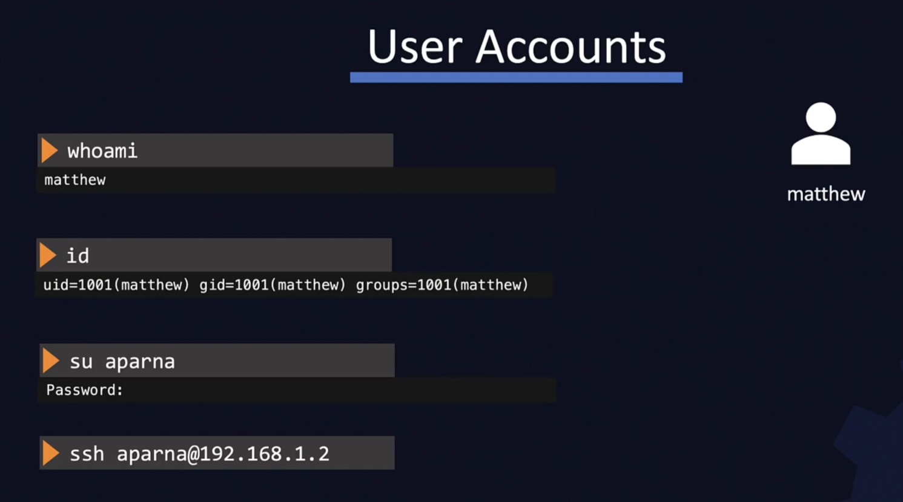

- KURS LINUX
  collapsed:: true
	- KOMENDY
	  collapsed:: true
		- Basic Commands
		  collapsed:: true
			- {:height 423, :width 676}
		- Commands - Directories
		  collapsed:: true
			- {:height 343, :width 673}
		- Commands - Files
		  collapsed:: true
			- {:height 407, :width 675}
		- User Accounts
		  collapsed:: true
			- {:height 387, :width 678}
			- {:height 217, :width 683}
		- Download Files
		  collapsed:: true
			- {:height 281, :width 680}
		- Check OS Version
		  collapsed:: true
			- {:height 437, :width 680}
		- Package Management
		  collapsed:: true
			- {:height 446, :width 678}
			- {:height 456, :width 680}
			- {:height 391, :width 680}
			- {:height 342, :width 683}
		- Services
		  collapsed:: true
			- 
			- 
			- 
			- 
- Narzędzia:
  collapsed:: true
	- Sprawdzanie dysku SSD (temp i inne)
		- https://www.maketecheasier.com/check-the-health-of-ssd-in-ubuntu/
		- ```
		  sudo apt install nvme-cli
		  sudo watch -n 1 nvme smart-log /dev/nvme0n1
		  ```
		- For this command, `watch -n 1` tells the tool to check the SMART log each second. The `nvme` portion refers to the type of drive, while the `smart-log` portion tells the tool to check the SMART log.
		  
		  After running the tool, check the following results to get a better idea of your SSD’s health in Linux:
		- **Temperature** – A safe range is 30°C to 65°C (86°F and 149°F). Usually, it’ll stay within the 30°C to 40°C range unless you’re a power user.
		- **Percentage_Used** – You want this number to be as low as possible. As it creeps over halfway, your SSD could be in trouble.
		- **Media_Errors** – A few errors aren’t much to worry 
		  about. But, if you start seeing a larger number of errors, it means more
		  of your drive is unreadable.
- Ostrość czcionek w przeglądarkach i Intellij
  collapsed:: true
	- `gsettings set org.gnome.desktop.interface text-scaling-factor 0.85`
	- https://askubuntu.com/questions/1415924/fractional-scaling-makes-browser-blurred
- Ustawienie Limitu Ładowania Baterii na Linuxie
  collapsed:: true
	- https://www.baeldung.com/linux/limit-battery-charge-level
- Ustawienie profili zasilania - POWER MODES
  collapsed:: true
	- ``sudo apt install power-profiles-daemon``
- Instalacja ROG CONTROL CENTER wraz z zarządzaniem przełączania kart graficznych
  collapsed:: true
	- asusctl - oprogramowanie ROG CONTROL CENTER(podswietlanie klawaitury nie działa)
	  collapsed:: true
		- https://forums.linuxmint.com/viewtopic.php?p=2452326
	- supergfxctl - oprogramowanie do przełączania kart graficznych
		- https://gitlab.com/asus-linux/supergfxctl
- BazziteOS
  collapsed:: true
	- Konfiguracja Distrobox:
		- Instalacja VS Codium w Distrobox (Fedora) z optymalizacją dla ekranu 4K:
			- ## Krok 1: Przygotowanie środowiska hosta
			  
			  Poniższe polecenia wykonaj w terminalu na swoim głównym systemie (np. Bazzite OS).
			  **Usuń stary kontener (opcjonalnie, ale zalecane):**
			  
			  Zazpewni to start od zera i uniknięcie konfliktów ze starymi konfiguracjami.
			- ```
			  distrobox rm -f fedora
			  ```
			- **Stwórz nowy, "czysty" kontener:**
			  
			  Tworzymy kontener bez żadnych dodatkowych montowań katalogów 
			  systemowych, aby uniknąć problemów z brakiem miejsca podczas instalacji.
			- ```
			  distrobox create --name fedora --image fedora:latest
			  ```
			- ## Krok 2: Instalacja VS Codium w kontenerze
			  
			  Teraz przechodzimy do pracy wewnątrz nowo stworzonego kontenera.
			- **Wejdź do kontenera:**
			- ```
			  distrobox-enter fedora
			  
			  ```
			  
			  **Ważne:** Wszystkie następne polecenia aż do ostatniego kroku wykonujesz **wewnątrz kontenera**.
			- **Zainstaluj VS Codium:**
			  
			  Dodajemy oficjalne repozytorium i instalujemy pakiet.
			- ```
			  sudo rpmkeys --import https://gitlab.com/paulcarroty/vscodium-deb-rpm-repo/-/raw/master/pub.gpg
			  printf "[gitlab.com_paulcarroty_vscodium_repo]\nname=download.vscodium.com\nbaseurl=https://download.vscodium.com/rpms/\nenabled=1\ngpgcheck=1\nrepo_gpgcheck=1\ngpgkey=https://gitlab.com/paulcarroty/vscodium-deb-rpm-repo/-/raw/master/pub.gpg\nmetadata_expire=1h" | sudo tee -a /etc/yum.repos.d/vscodium.repo
			  sudo dnf install -y codium
			  
			  ```
			- ## Krok 3: Synchronizacja konfiguracji czcionek
			  
			  Po
			  udanej instalacji nadpisujemy konfigurację czcionek w kontenerze tą z 
			  Twojego systemu-hosta, aby zapewnić identyczne renderowanie.
			  
			  ```
			  sudo mkdir -p /etc/fonts
			  
			  sudo cp -rf /run/host/etc/fonts/* /etc/fonts/
			  ```
			- ## Krok 4: Konfiguracja dla ekranu 4K (HiDPI)
			  
			  Tworzymy prosty skrót (`alias`),
			  który będzie uruchamiał VS Codium z flagami wymuszającymi natywny tryb 
			  Wayland i poprawne skalowanie – jest to klucz do idealnej ostrości.
			- **Dodaj alias do pliku `.bashrc`:**
			  
			  Skopiuj i wklej poniższą komendę. Automatycznie dopisze ona na końcu pliku konfiguracyjnego definicję skrótu `codium-sharp`.
			- ```
			  echo 'alias codium-sharp="codium --enable-features=UseOzonePlatform --ozone-platform=wayland --force-device-scale-factor=1 --disable-font-subpixel-positioning"' >> ~/.bashrc
			  
			  ```
			- **Aktywuj nowy skrót w bieżącej sesji:**
			  
			  "Odśwież" konfigurację terminala, aby nowy alias był od razu dostępny.
			- ```
			  source ~/.bashrc
			  
			  ```
			- ## Krok 5: Uruchomienie i weryfikacja
			  
			  Wszystko jest gotowe. Aby uruchomić VS Codium z poprawnymi ustawieniami, użyj nowo stworzonego skrótu.
			  
			  ```
			  codium-sharp
			  ```
			  
			  Od teraz, za każdym razem, gdy będziesz chciał uruchomić VS Codium w tym kontenerze, po prostu wejdź do niego (`distrobox-enter fedora`) i wpisz `codium-sharp`. Aplikacja uruchomi się z idealnie ostrym interfejsem i tekstem.
- LinuxMint
  collapsed:: true
	- Instalacja Snap store (inny sklep z aplikacjami)
		- From Linux Mint 20 onwards, installing Snap is blocked by a file called `nosnap.pref` in the directory `/etc/apt/preferences.d/`; this file needs to be either moved or removed from the directory, or renamed with an extension other than `.pref` before Snap can be installed.
		- This can be accomplished from the command line, and the following command (for example) renames `nosnap.pref` to `nosnap.backup`:
		- ```
		  sudo mv /etc/apt/preferences.d/nosnap.pref /etc/apt/preferences.d/nosnap.backup
		  ```
		- With the file renamed, the package database needs to be updated next:
		- ```
		  sudo apt update
		  ```
		- To now install snap from the Software Manager application, search for *snapd* and click **Install**.
		- Alternatively, *snapd* can be installed from the command line:
		- ```
		  sudo apt install snapd
		  ```
		- To complete the installation, either restart your machine, or log out and in again.
		- To test your system, install the [hello-world](https://snapcraft.io/hello-world) snap and make sure it runs correctly:
		- ```
		  $ snap install hello-world
		  hello-world 6.4 from Canonical✓ installed
		  $ hello-world
		  Hello World!
		  ```
		- Snap is now installed and ready to go! If you’re using a desktop, a great next step is to [install the Snap Store app](https://snapcraft.io/docs/installing-snap-store-app).