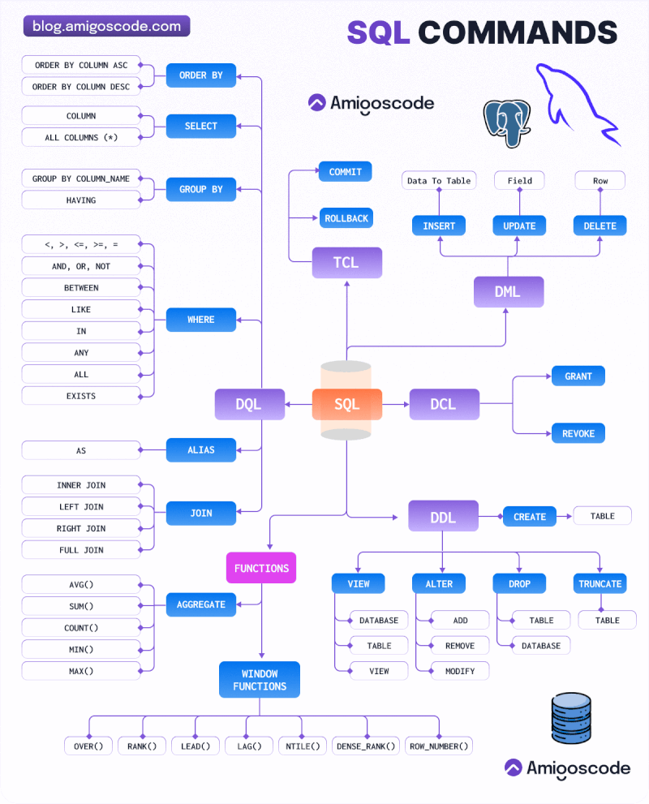
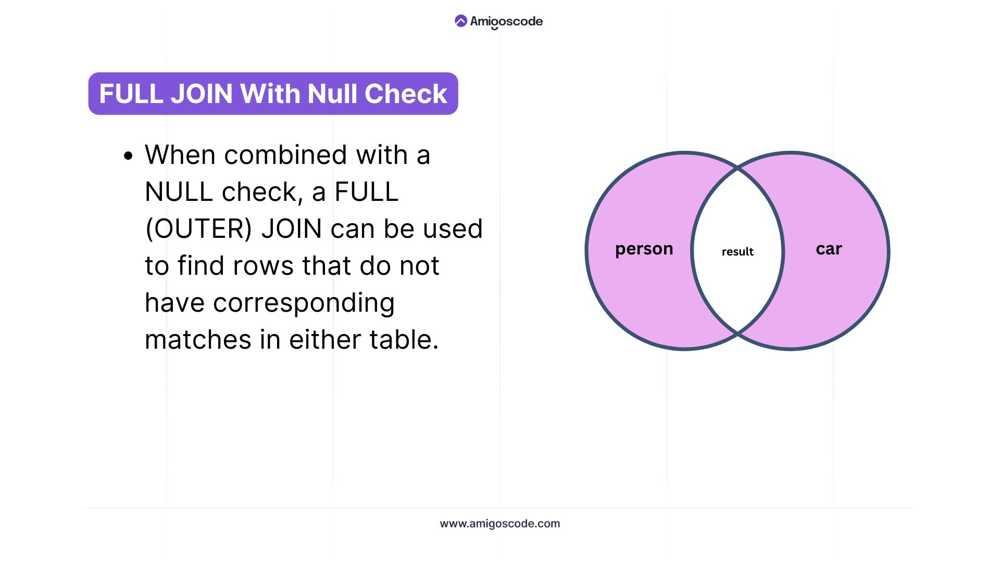

- Komendy SQL
  collapsed:: true
	- SQL Commands Cheatsheet:
	  collapsed:: true
		- 
			- 1. DDL (Data Definition Language): Commands to define and manage the structure of database objects.
			- 2. TCL (Transaction Control Language): Commands to manage transactions in the database.
			- 3. DQL (Data Query Language): Commands to query and retrieve data from the database.
			- 4. DCL (Data Control Language): Commands to control access to data within the database.
			- 5. DML (Data Manipulation Language): Commands to manipulate data stored in the database.
			- Functions:
				- Aggregate Functions: Functions that perform calculations on a set of values and return a single value (e.g., SUM, AVG, COUNT).
				- Window Functions: Functions that perform calculations across a set of 
				  table rows that are related to the current row, without collapsing the 
				  result into a single value (e.g., ROW_NUMBER, RANK, LEAD).
	-
- Join SQL
  collapsed:: true
	- 
	- 
	- 
	- 
	- 
	- 
	- 
	- 
	- 
	- 
	- 