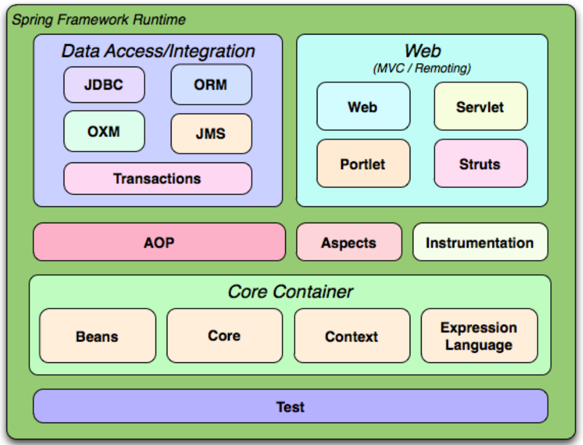
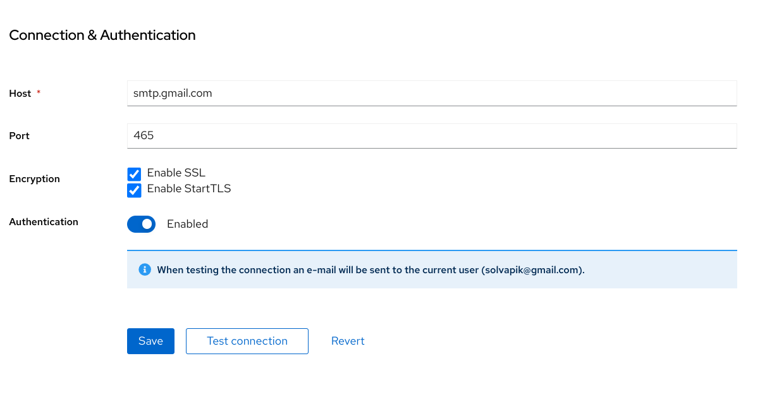

### Pytania rekrutacyjne
collapsed:: true
	- **1. Czym jest Spring?**
		- Spring to framework do tworzenia aplikacji w Javie,  oferujący m.in. kontener IoC, wstrzykiwanie zależności, programowanie  aspektowe i wiele modułów ułatwiających tworzenie aplikacji.
		- Źródło:
		  https://docs.spring.io/spring-framework/docs/3.2.x/spring-framework-reference/html/overview.html
		  {:height 454, :width 523}
		-
	- **2. Czy Spring i Spring Boot to to samo?**
	  collapsed:: true
		- Spring i Spring Boot to nie to samo. Spring Boot to projekt 
		  zbudowany na bazie Spring Framework, który ułatwia tworzenie aplikacji 
		  Spring poprzez automatyczną konfigurację
	- **3. Na jakim porcie uruchamiana jest domyślnie springbootowa aplikacja? Czy można go zmienić?**
	  collapsed:: true
		- Domyślny port dla aplikacji Spring Boot to **8080**. Można go zmienić np. w pliku application.properties za pomocą wpisu **server.port: 9090**
	- **4. Co to jest Bean?**
	  collapsed:: true
		- Bean to obiekt zarządzany przez kontener IoC Springa
	- **5. Jaki scope może mieć bean w Springu?**
	  collapsed:: true
		- Spring oferuje różne zakresy (scopes) dla beanów, m.in.:
			- **singleton** (domyślny) - jeżeli bean ma ustawiony zakres jako singleton, to tylko jeden obiekt tego beana będzie zarządzany przez kontener Springa. Oznacza to, że jeżeli kilka razy będziemy chcieli „pobrać” tego beana, to za każdym razem będziemy dostawać tę samą instancję Beana.
			- **prototype** - za każdym razem, kiedy próbujemy pobrać Beana, dostajemy nową instancję tego beana (tzn. np. poprzez iniekcję do innego beana, lub pobranie bezpośrednio przy użyciu metody **.getBean()**.
			- **request** - używane w aplikacjach webowych. Ustawia zakres beana na cykl życia pojedynczego żądania http. Oznacza to, że każde żądanie będzie posiadało swoją własną instancję beana.
			- **session** - używane w aplikacjach webowych. Zakres beana równa się zakresowi sesji http.
			- **global-session** - jak wyżej, z tym że odnosi się do globalnego zakresu sesji http.
	- **6. Jaki jest domyślny scope dla beanów springowych?**
	  collapsed:: true
		- Domyślnym zakresem dla beanów w Spring jest singleton
	- **7. Czy bean mający scope Singleton jest bezpieczny w środowisku wielowątkowym/jest thread-safe?**
	  collapsed:: true
		- Beany o zakresie singleton nie są domyślnie bezpieczne w środowisku wielowątkowym (thread-safe). Programista musi zadbać o ich bezpieczeństwo, jeśli bean przechowuje stan.
	- **8. Co to jest wstrzykiwanie zależności (dependency injection)?**
	  collapsed:: true
		- Wstrzykiwanie zależności to wzorzec projektowy, który pozwala na  przekazywanie zależności (np. obiektów) do komponentów aplikacji zamiast tworzenia ich bezpośrednio w kodzie. Dzięki temu komponenty są bardziej elastyczne, łatwiejsze do testowania i utrzymania.
	- **9. Jakie znasz sposoby wstrzykiwania zależności? Który jest preferowany?**
	  collapsed:: true
		- W Springu można wstrzykiwać zależności na trzy sposoby:
			- Przez konstruktor (preferowany sposób)
			- Przez setter
			- Przez pole (field injection)
			  
			  Wstrzykiwanie przez konstruktor jest preferowane, ponieważ  zapewnia, że wszystkie zależności są dostępne w momencie tworzenia  obiektu i ułatwia testowanie.
	- Jaka jest różnica między adnotacjami @Autowired oraz @Inject?
	- Czy adnotacja @Autowired jest obowiązkowa w przypadku wstrzykiwania przez konstruktor?
	- W jaki sposób możemy wstrzyknąć wartość jakiegoś property, np. spring.datasource.url?
	- Do czego służy adnotacja @PostConstruct?
	- Do czego służy adnotacja @Profile?
	- Co dają nam profile springowe?
	- Jaka jest różnica między adnotacjami @Qualifier oraz @Primary? Która ma pierwszeństwo?
	- Co to jest DispatcherServlet?
	- Czy możemy mieć w controllerze dwie metody z adnotacją @GetMapping i taką samą ścieżką, np. /number?
	- Jaka jest różnica między adnotacjami @PathVariable i @RequestParam?
	- Czy możemy zmapować metodę HTTP DELETE na dodawanie użytkowników w bazie danych?
	- Czym się różnią Filter oraz HandlerInterceptor?
	- Do czego służy adnotacja @ExceptionHandler? Czy możemy użyć jej globalnie dla wszystkich controllerów?
	- Czy przechwytywanie wyjątków w komponencie z adnotacją @ControllerAdvice dotyczy wszystkich controllerów?
	- Po co nam mechanizm migracji bazy danych? Jakie narzędzia do tego celu wspiera Spring Boot?
	- Czy interfejs JpaRepository jest parametryzowany? Jeśli tak, to jakie parametry typu wymaga?
	- Do czego służy klasa JdbcTemplate?
	- Co to są poziomy izolacji transakcji? Wymień je i krótko omów.
	- Jakie rodzaje propagacji transakcji są dostępne w springu?
	- Jeśli w trakcie procesowania metody oznaczonej adnotacją @Transactional zostanie rzucony wyjątek, to będzie miał miejsce rollback czy nie?
	- W jaki sposób możemy opublikować zdarzenie w springu?
	- Czy metoda oznaczona adnotacją @EventListener może coś zwracać czy musi być void? Jakie to ma konsekwencje?
	- Z jakiego CacheManagera domyślnie korzysta Spring?
	- Do czego służy klasa RestTemplate?
	- Do czego służą adnotacje takie jak @Before, @Around, @After?
	- Czy kojarzysz adnotacje takie jak @Email, @Max, @Min, @Null, @Pattern? Do czego one służą?
- Spring Security
  collapsed:: true
	- Keycloak
	  collapsed:: true
		- Tutorial jak skonfigurować keycloak z api-gateway w mikroserwisach (od 2:00:00)
		  {{video https://www.youtube.com/watch?v=yn_stY3HCr8&t=7216s}}
	- Konfiguracja Keycloak -> wysyłka maila
		- Aby wysłać maila:
		  
		  Trzeba wygenerować hasło na koncie google: 
		  Bezpieczeństwo -> Weryfikacja dwuetapowa -> Hasła do aplikacji (na samym dole)
		  Logujemy się naszym mailem i wygenerowanym hasłem
- Spring Boot Config Server - połączenie się z prywatnym repo na githubie
  collapsed:: true
	- Aby połaczyć sie z prywtnym repo na gitcie trzeba wygenerować token i dać pozwolenie do odczyty z repozytorium (**Contents** -> **Access: Read-only**)
	  https://docs.github.com/en/authentication/keeping-your-account-and-data-secure/managing-your-personal-access-tokens#creating-a-fine-grained-personal-access-token
	- ```
	  spring:
	    application:
	      name: "config-server"
	    profiles:
	      active: git
	    cloud:
	      config:
	        server:
	          git:
	            uri: git@github.com:${USERNAME}/${REPO_NAME}.git
	            default-label: main
	            timeout: 5
	            clone-on-start: true
	            username: ${USERNAME}
	            password: ${PASSWORD}
	  
	  server:
	    port: 8888
	  ```