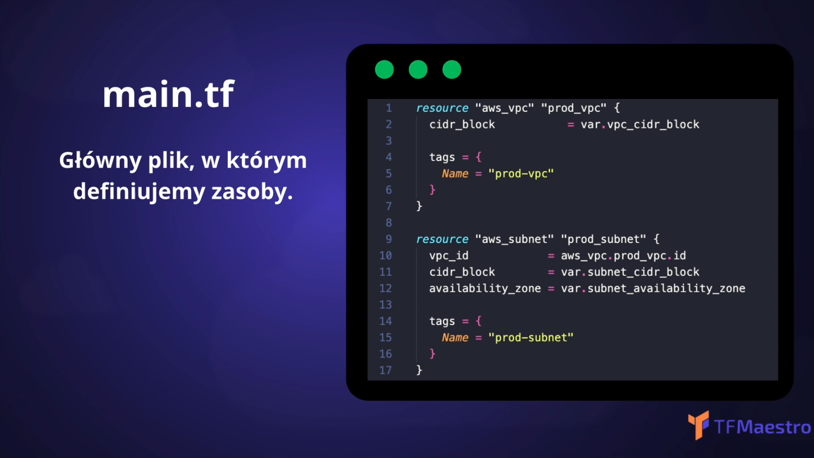
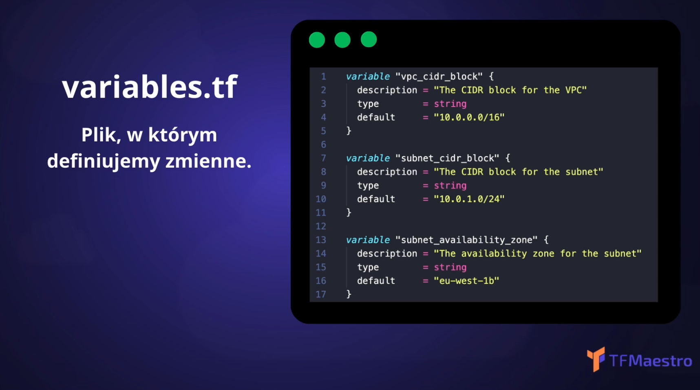
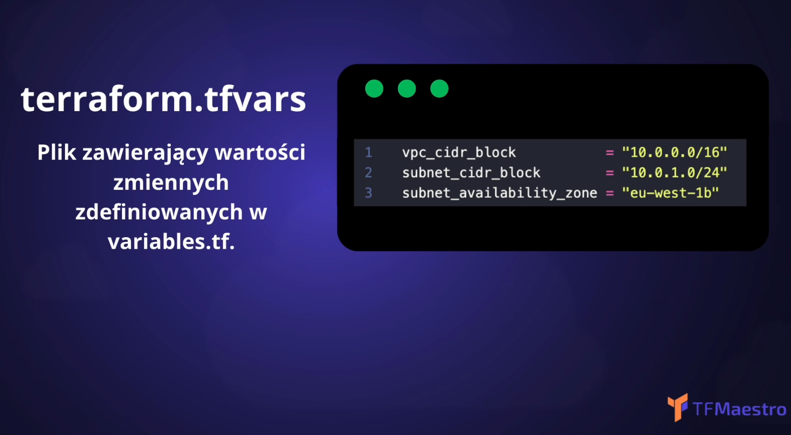
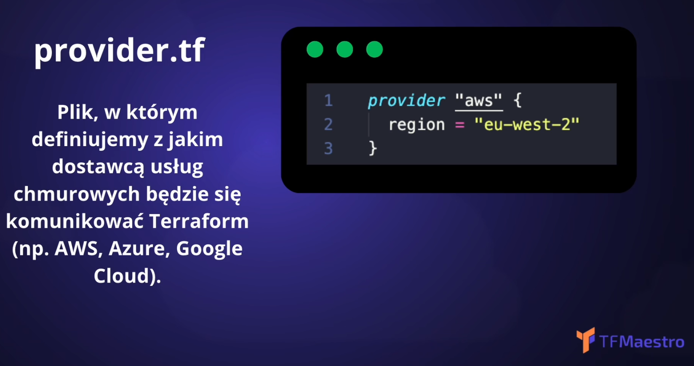
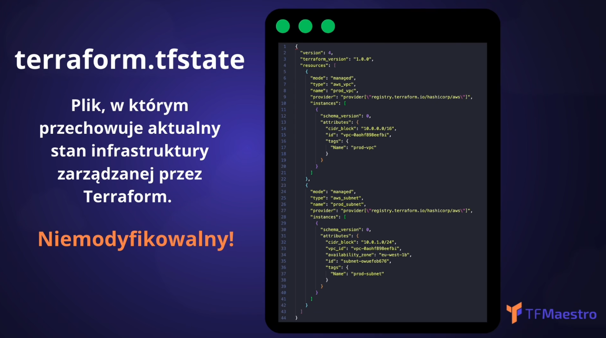
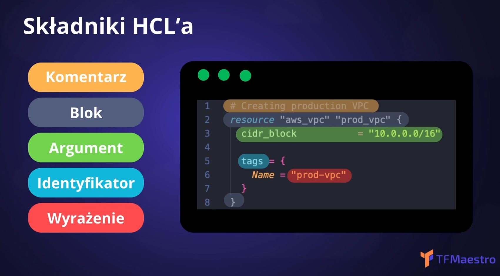
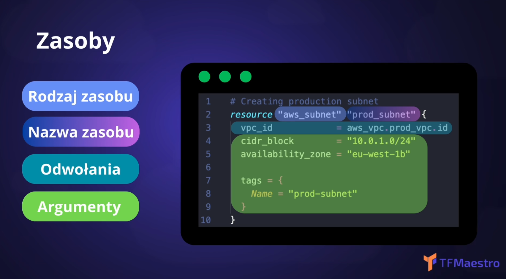
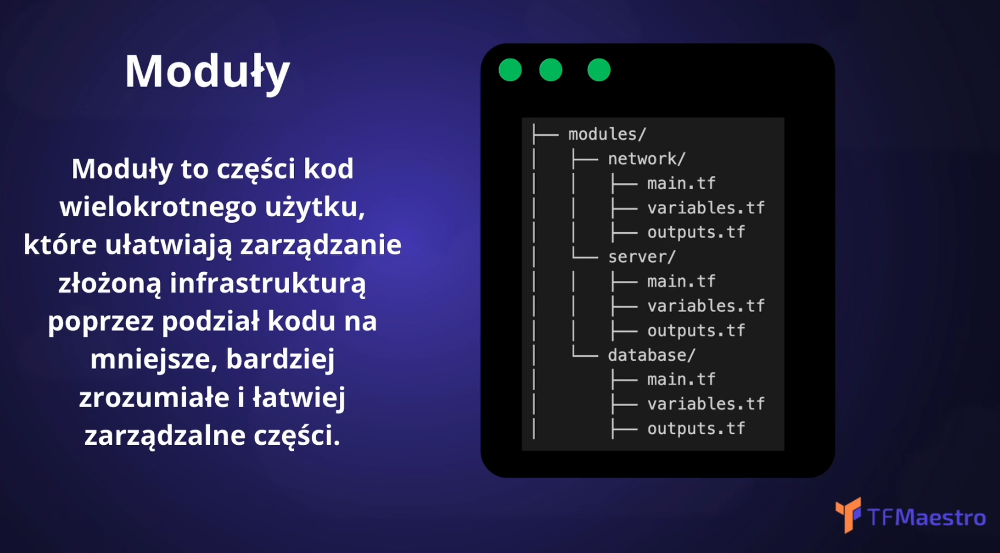
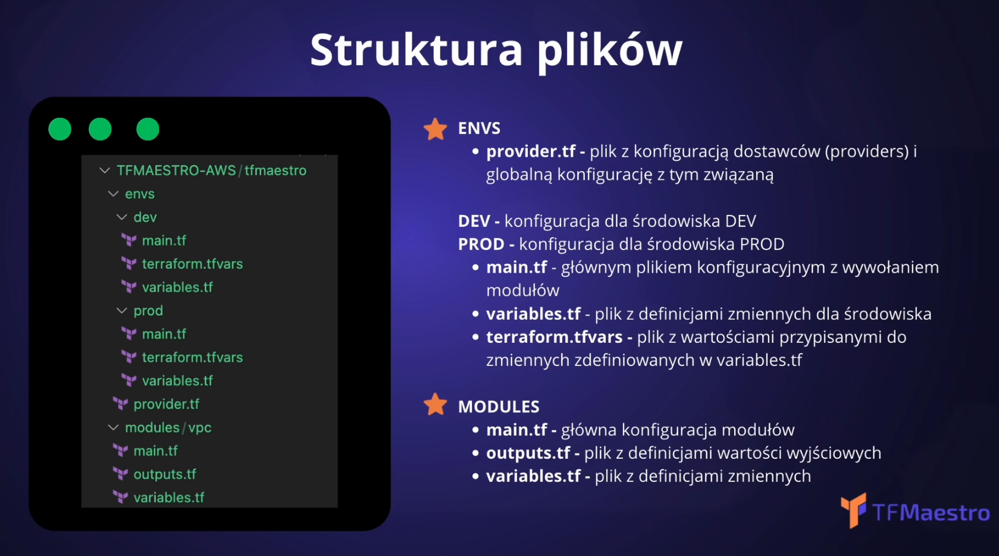

## Wprowadzenie do Terraform i Infrastracture as Code (IaC)
logseq.order-list-type:: number
	- Terraform i język HCL (Hashicorp Configuraation Language)
	  collapsed:: true
		- {:height 406, :width 686}
		  {:height 397, :width 687}
		  {:height 399, :width 687}
		  {:height 392, :width 692}
		  {:height 388, :width 692}
		  {:height 374, :width 691}
		  {:height 374, :width 691}
		  {:height 402, :width 691}
		  {:height 393, :width 692}
		  {:height 393, :width 693}
		  {:height 395, :width 694}
		  {:height 397, :width 696}
		-